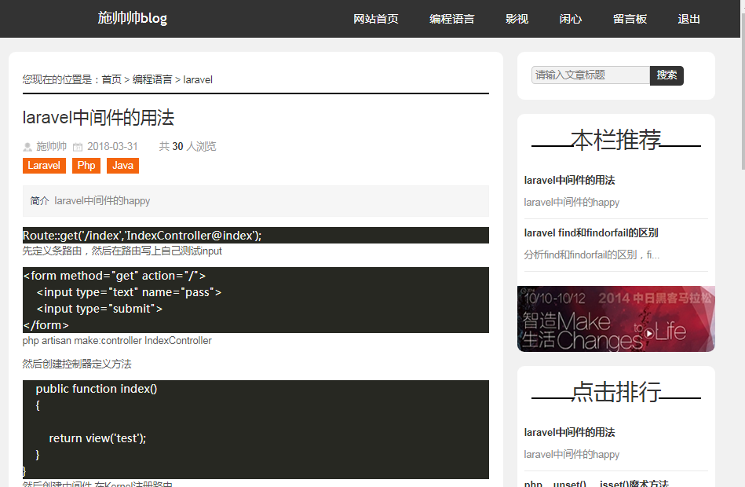

# 这是我的blog项目

介绍

以laravel5.5开发的blog项目，写这个应用的目的是为了总结前面的laravel知识点

文章页

>## 功能
支持多用户管理

前后台用户分离管理

文章管理

导航栏管理

评论.留言管理

友情链接管理

缓存管理

>##样式
后台主要用bootstrap搭建也用了layui

前台引用了杨青的前台模板

>## 安装方法

git clone https://github.com/slw415/newBlogs.git

composer update

php artisan migrate

修改.env文件 

>## 后台登陆

http://www.slwcnbk.cn/admin/login

账号：slw415 密码：slw415415
  